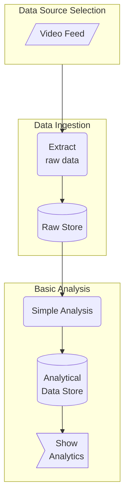

# Yeti Insights
Yeti Insights is a system which can be used by commercial establishments to capture and analyse crowd behaviour using object detection and face recognition.

# Table of Contents 
1. [Business Process Flow](#business-process-flow)
2. [System Context Diagram](#system-context-diagram)
3. [System Container Diagram](#system-container-diagram)

# Business Process Flow 
This diagram describes the business process flow of Yeti System. It basically is showing the data flow among the major business processes.

# System Context Diagram 

This diagram depicts the major systems both external and internal Yeti system. 

 

# System Container Diagram 
Following are the independent deployable units or containers which are required to create a fully functional system.

 

# System Component Diagram 
Following diagram depicts different modules which will encapsulate different business logic in the Yeti system.

