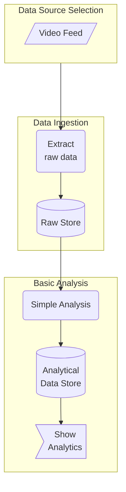
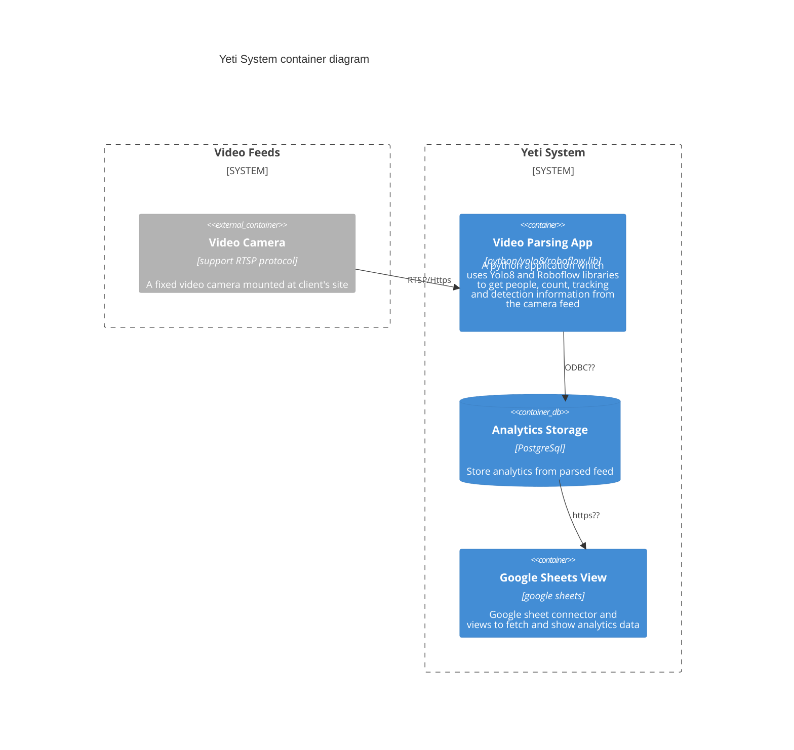

# Table of Contents 
1. [Business Process Flow](#business-process-flow)
2. [System Container Diagram](#system-container-diagram)

# Business Process Flow 
This diagram describes the business process flow of Yeti System.

# System Container Diagram 
Following are the independent deployable units or containers which are required to create a fully functional system.

