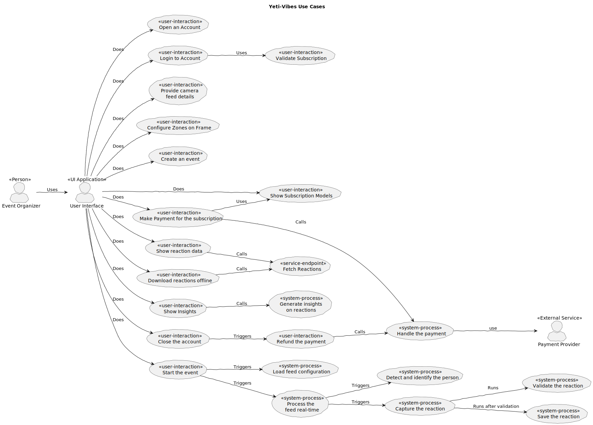

# Introduction

Yeti-Vibes system is a reaction gathering system for events organized by clients

1. It is a reaction gathering system.
2. It can be deployed in any event.
3. It can be deployed via
   1. An RTSP enabled camera
   2. By a mobile/Tab device

# Requirements

## Definitions

### Client

A client is subscriber of the Yeti-Vibes system. They deploy this system to gather simple feed back or reaction from the visitors, of the event.

### Event

An event is an activity organized by the client for a specific duration. Event can be of two types:

1. A one time event happening for a specific duration. for e.g. an exhibition
2. A same event happening either at same or different places on different periods of time. for e.g. a concert, a roadshow
3. A recurring/un-ending event happening periodically at the same place. for e.g.

### RTSP

RTSP stands for Real-Time Streaming protocol. RTSP is commonly used for streaming media, such as video or audio streams, and is best for media that needs to be broadcasted in real-time.

## Use-Cases

### Diagram

### Documentation
- [Use-Case: 145 - Show List of events](use-cases/145-Show_List_of_events.md)
- [Use-Case: 150 - Start the event](use-cases/150-Start_the_event.md)
- [Use-Case: 160 - Load Feed Configuration](use-cases/160-Load_Feed_Configuration.md)
- [Use-Case: 180 - Process the feed in real-time](use-cases/180-Process_the_feed_real-time.md)
